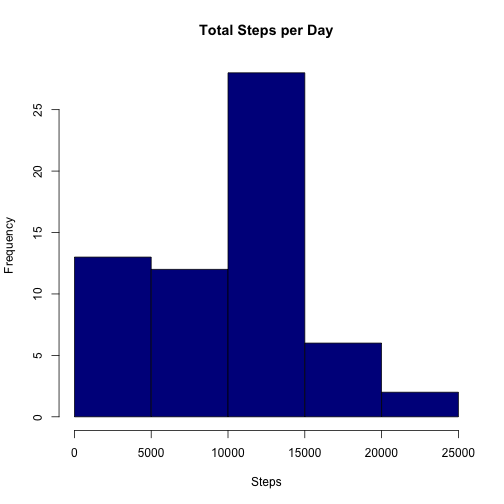
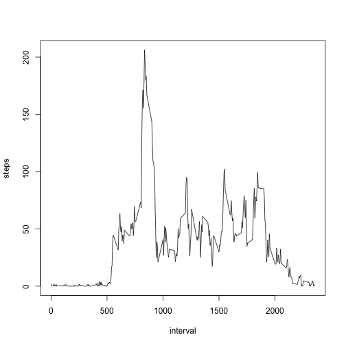
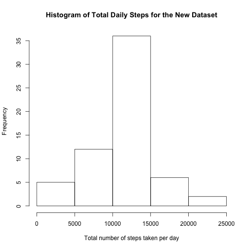
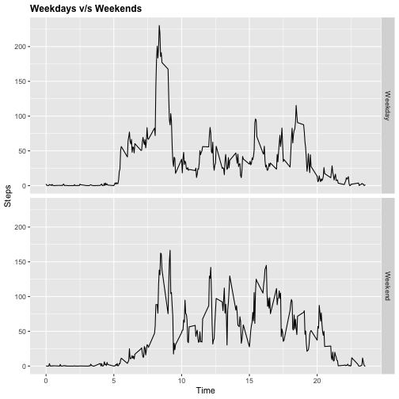

  
### Importing Libraries

```r
library(ggplot2)
```
  
### Processing Data

```r
if(!file.exists("activity.zip")){
  download.file("https://d396qusza40orc.cloudfront.net/repdata%2Fdata%2Factivity.zip",destfile = "./activity.zip")
}
if(!file.exists("activity.csv")){unzip("activity.zip")}
activity <- read.csv("activity.csv")
```

### Histogram of Total Steps per Day

```r
stepsPerDay <- data.frame(tapply(activity$steps, activity$date, FUN=sum, na.rm=TRUE))
stepsPerDay$date <- rownames(stepsPerDay)
rownames(stepsPerDay) <- NULL
colnames(stepsPerDay)[1] <- c("steps")
```
OR, the above process could have been done in one step: "stepsPerDay <- aggregate(steps~date, activity, sum, na.rm=TRUE)"
Now to plotting the histogram of the total steps per day:

```r
hist(stepsPerDay$steps, main = "Total Steps per Day", xlab = "Steps", col = "darkblue")
```



Mean and Median of the total steps per day

```r
mean(stepsPerDay$steps)
```

```
## [1] 9354.23
```

```r
median(stepsPerDay$steps)
```

```
## [1] 10395
```

### Time series plot of the average number of steps taken per day

```r
intervalSteps <- aggregate(steps~interval,activity,mean,na.rm=TRUE)
plot(steps~interval,intervalSteps,type="l")
```



Which 5-minute interval, on average across all the days in the dataset, contains the maximum number of steps?

```r
maxStepsIndex <- which.max(intervalSteps$steps)
intervalWithMaxSteps <- intervalSteps[maxStepsIndex,]$interval
intervalWithMaxSteps
```

```
## [1] 835
```

Total number of NAs in the dataset

```r
totalNA <- sum(is.na(activity$steps))
totalNA
```

```
## [1] 2304
```

New dataset with NA values filled in with the mean value for that interval

```r
imputedSteps <- ifelse(is.na(activity$steps), round(intervalSteps$steps[match(activity$interval, intervalSteps$interval)],0), activity$steps)
newActivityDataset <- data.frame(steps=imputedSteps,date=activity$date,interval=activity$interval)
```

### Histogram of the total number of steps taken each day for the new dataset

```r
newDailySteps <- aggregate(steps~date,newActivityDataset,sum)
hist(newDailySteps$steps,xlab = "Total number of steps taken per day",main = "Histogram of Total Daily Steps for the New Dataset")
```



Mean and Median number of steps taken per day for the new dataset

```r
newMeanDailySteps <- mean(newDailySteps$steps)
newMeanDailySteps
```

```
## [1] 10765.64
```

```r
newMedianDailySteps <- median(newDailySteps$steps)
newMedianDailySteps
```

```
## [1] 10762
```

Imputing missing data does seem to have a small effect on the mean and median values. Mean value went from 10766.19 to 10765.64 while the median value went from 10765 to 10762.

Creating a new factor variable in the dataset with two levels – “weekday” and “weekend” indicating whether a given date is a weekday or weekend day

```r
newActivityDataset$RealDate <- as.Date(newActivityDataset$date, format = "%Y-%m-%d")
newActivityDataset$Weekday <- weekdays(newActivityDataset$RealDate)
newActivityDataset$DayType <- ifelse(newActivityDataset$Weekday=='Saturday' | newActivityDataset$Weekday=='Sunday', 'Weekend','Weekday')
```

### Two time series plot of the 5-minute interval (x) and the average number of steps taken averaged across weekdays or weekends (y)

```r
StepsPerTimeDT <- aggregate(steps~interval+DayType,data=newActivityDataset,FUN=mean,na.action=na.omit)
StepsPerTimeDT$time <- intervalSteps$interval/100
j <- ggplot(StepsPerTimeDT, aes(time, steps))
j+geom_line(col="black")+ggtitle("Weekdays v/s Weekends")+xlab("Time")+ylab("Steps")+theme(plot.title = element_text(face="bold", size=12))+facet_grid(DayType ~ .)
```


